# DigiVaultMobile


Mobile client for **DigiVault** — a digital content marketplace where users can browse, purchase, and sell online courses. Built with React Native CLI and TypeScript.

---

## Features

- Browse and search courses by category
- Purchase courses and access them in My Vault
- Wishlist and cart management
- JWT-based authentication (login & registration)
- Seller dashboard — create, edit, and manage course listings
- In-app notifications
- Order history with order details
- User profile management (name, email, password, balance)
- Course reviews and ratings
- Course reporting

---

## Screenshots

### Browsing

<p align="center">
  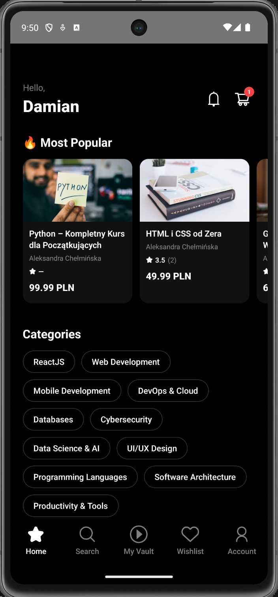
  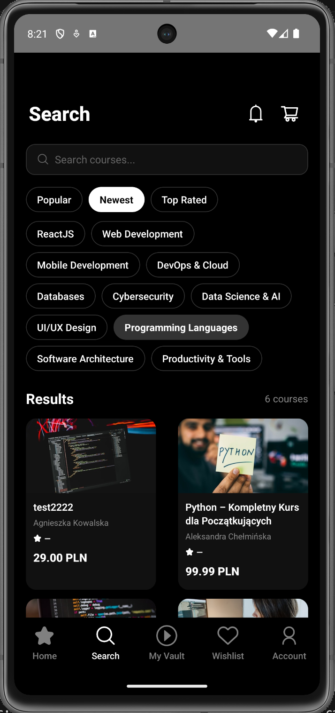
  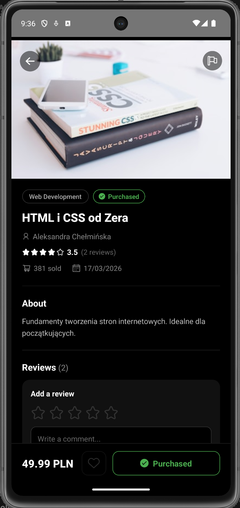
</p>
<p align="center">
  <em>Home &nbsp;&nbsp;&nbsp;&nbsp;&nbsp;&nbsp;&nbsp;&nbsp;&nbsp;&nbsp;&nbsp;&nbsp;&nbsp;&nbsp;&nbsp;&nbsp;&nbsp;&nbsp; Search &nbsp;&nbsp;&nbsp;&nbsp;&nbsp;&nbsp;&nbsp;&nbsp;&nbsp;&nbsp;&nbsp;&nbsp;&nbsp;&nbsp;&nbsp;&nbsp;&nbsp;&nbsp; Course details</em>
</p>

### Cart, Wishlist & Reviews

<p align="center">
  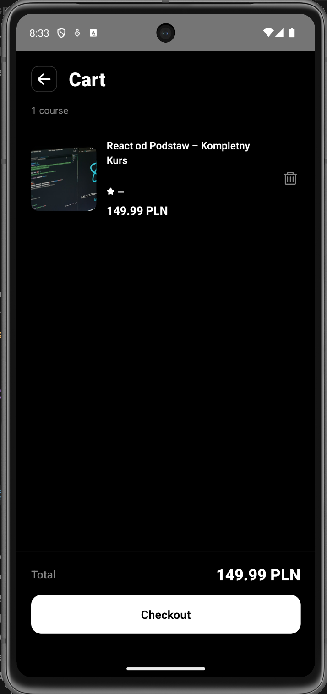
  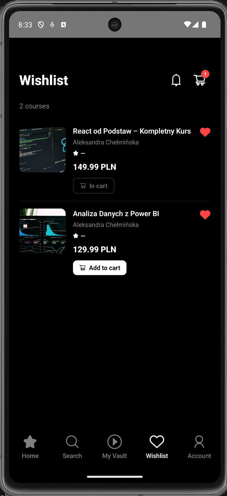
  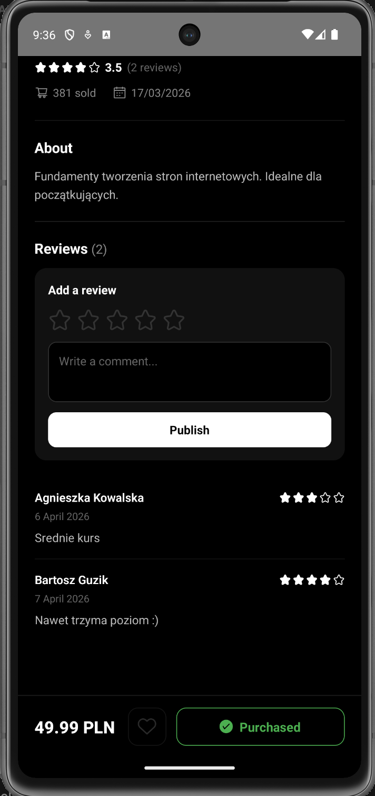
</p>
<p align="center">
  <em>Cart &nbsp;&nbsp;&nbsp;&nbsp;&nbsp;&nbsp;&nbsp;&nbsp;&nbsp;&nbsp;&nbsp;&nbsp;&nbsp;&nbsp;&nbsp;&nbsp;&nbsp;&nbsp; Wishlist &nbsp;&nbsp;&nbsp;&nbsp;&nbsp;&nbsp;&nbsp;&nbsp;&nbsp;&nbsp;&nbsp;&nbsp;&nbsp;&nbsp;&nbsp;&nbsp;&nbsp;&nbsp; Reviews</em>
</p>

### Orders

<p align="center">
  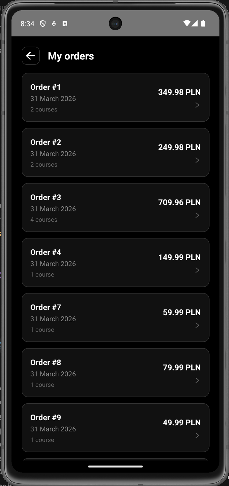
  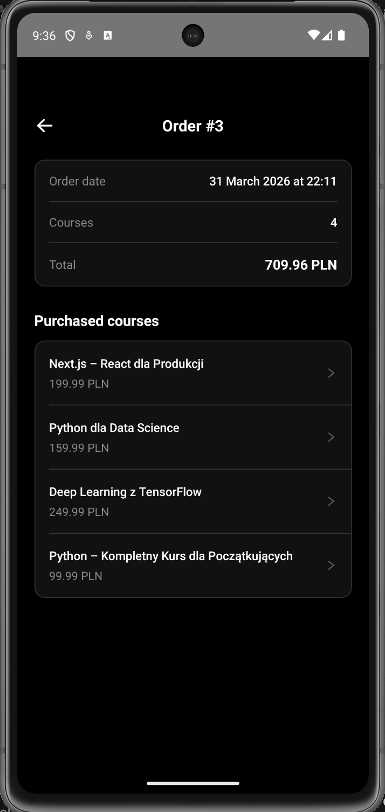
</p>
<p align="center">
  <em>Orders &nbsp;&nbsp;&nbsp;&nbsp;&nbsp;&nbsp;&nbsp;&nbsp;&nbsp;&nbsp;&nbsp;&nbsp;&nbsp;&nbsp;&nbsp;&nbsp;&nbsp;&nbsp; Order details</em>
</p>

### Account

<p align="center">
  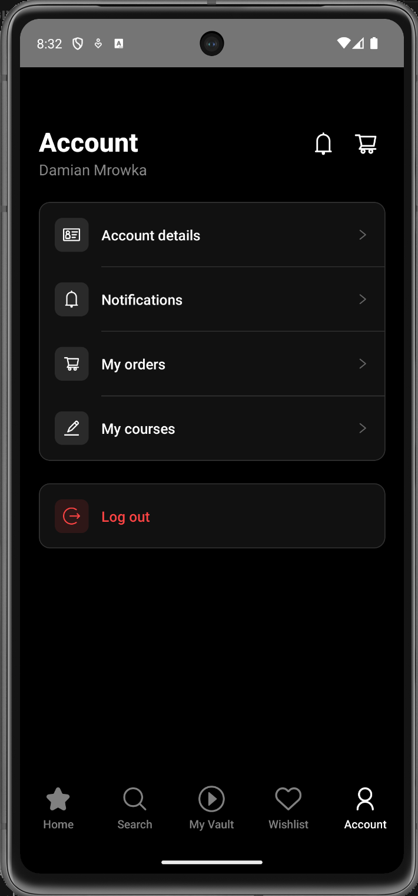
  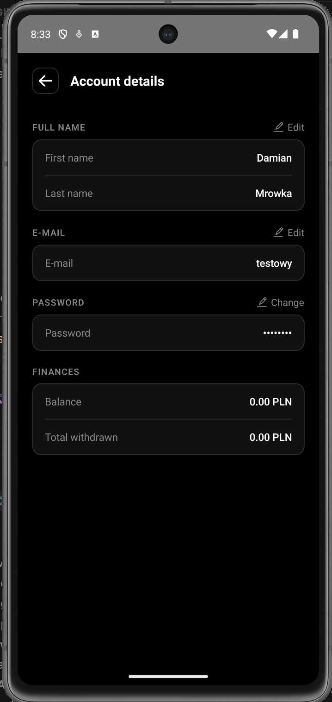
  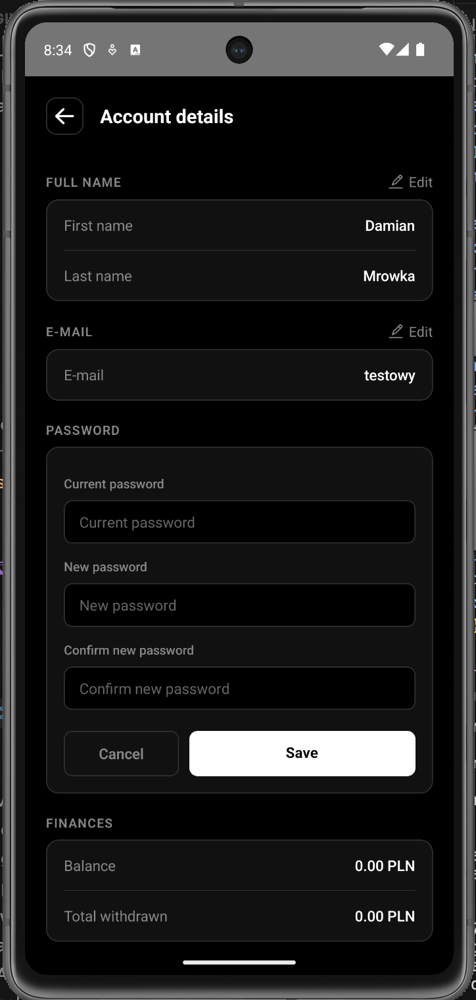
</p>
<p align="center">
  <em>Account &nbsp;&nbsp;&nbsp;&nbsp;&nbsp;&nbsp;&nbsp;&nbsp;&nbsp;&nbsp;&nbsp;&nbsp; Account details &nbsp;&nbsp;&nbsp;&nbsp;&nbsp;&nbsp;&nbsp;&nbsp;&nbsp;&nbsp;&nbsp;&nbsp; Editing</em>
</p>

### Seller

<p align="center">
  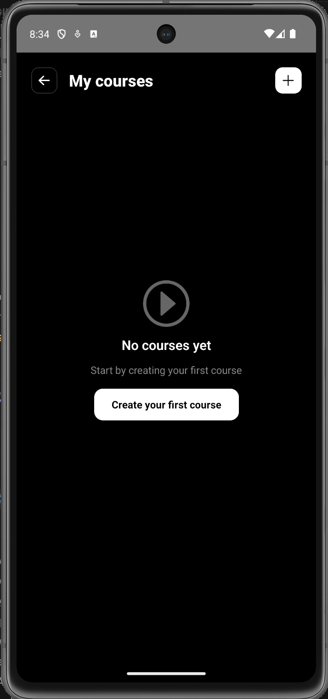
  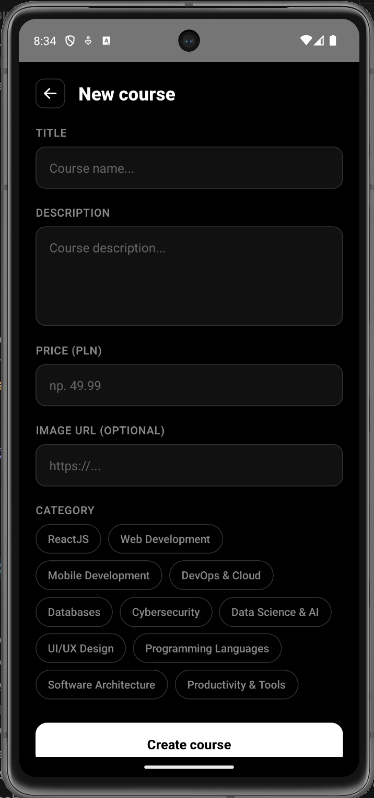
</p>
<p align="center">
  <em>My courses &nbsp;&nbsp;&nbsp;&nbsp;&nbsp;&nbsp;&nbsp;&nbsp;&nbsp;&nbsp;&nbsp;&nbsp;&nbsp;&nbsp;&nbsp;&nbsp;&nbsp;&nbsp; New course</em>
</p>

---

## Tech Stack

| Category | Library |
|---|---|
| Framework | React Native CLI 0.84 |
| Language | TypeScript 5.8 |
| Navigation | React Navigation 7 (Native Stack + Bottom Tabs) |
| Server state | TanStack React Query 5 |
| Auth | JWT via AsyncStorage |
| Icons | react-native-vector-icons (AntDesign) |
| Environment | react-native-dotenv |

---

## Prerequisites

Make sure the following are installed on your machine:

- [Node.js](https://nodejs.org/) >= 22.11.0
- [React Native CLI environment](https://reactnative.dev/docs/environment-setup) (Android Studio / Xcode)
- **iOS only:** CocoaPods (`sudo gem install cocoapods`)

---

## Installation & Setup

### 1. Clone the repository

```bash
git clone https://github.com/your-org/DigiVaultMobile.git
cd DigiVaultMobile
```

### 2. Install dependencies

```bash
npm install
```

### 3. Configure environment variables

```bash
cp .env.example .env
```

Open `.env` and fill in your values:

```env
API_BASE_URL_ANDROID=http://10.0.2.2:5052
API_BASE_URL_IOS=http://localhost:5052
```

> **Note:** Use `http://10.0.2.2:<port>` for Android emulators and `http://localhost:<port>` for iOS simulators. `10.0.2.2` is the loopback alias that routes from the Android emulator to the host machine.

### 4. iOS only — install CocoaPods

```bash
cd ios && pod install && cd ..
```

---

## Running the App

Start the Metro bundler:

```bash
npm start
```

### Android

```bash
npm run android
```

### iOS

```bash
npm run ios
```

> After changing `.env`, always restart Metro with a cleared cache:
> ```bash
> npm start -- --reset-cache
> ```

---

## Project Structure

```
src/
├── api/            # HTTP request functions (one file per domain)
│   ├── config.ts       # Shared fetch wrapper & auth headers
│   ├── authApi.ts
│   ├── coursesApi.ts
│   └── ...
├── assets/         # Static assets (images, logo)
├── components/     # Reusable UI components
│   ├── CourseCard.tsx
│   ├── StarRating.tsx
│   ├── NotificationBell.tsx
│   └── ...
├── config/         # App-wide constants and theme
│   ├── constants.ts    # BASE_URL from environment
│   └── theme.ts        # Color palette
├── hooks/          # React Query hooks (data fetching & mutations)
│   ├── useCourses.ts
│   ├── useCart.ts
│   ├── useCurrentUser.ts
│   └── ...
├── navigation/     # Stack & tab navigator setup
│   └── AppNavigator.tsx
├── screens/        # One file per screen
│   ├── HomeScreen.tsx
│   ├── CourseDetailScreen.tsx
│   ├── CartScreen.tsx
│   └── ...
└── types/          # TypeScript interfaces and navigation types
    ├── course.ts
    ├── navigation.ts
    └── ...
```

---

## Environment Variables

| Variable              | Description                        |
|-----------------------|------------------------------------|
| API_BASE_URL_ANDROID  | Backend URL for Android emulator   |
| API_BASE_URL_IOS      | Backend URL for iOS simulator      |

**Android emulator** — the emulator cannot reach `localhost` on the host machine directly. Use the special alias instead:

> `.env` is listed in `.gitignore` and will never be committed. Use `.env.example` as the source of truth for required variables.

---

## License

[MIT](LICENSE)
